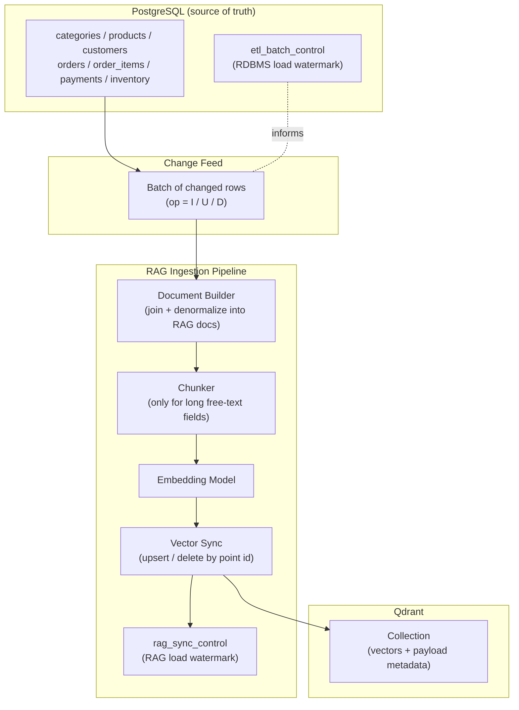
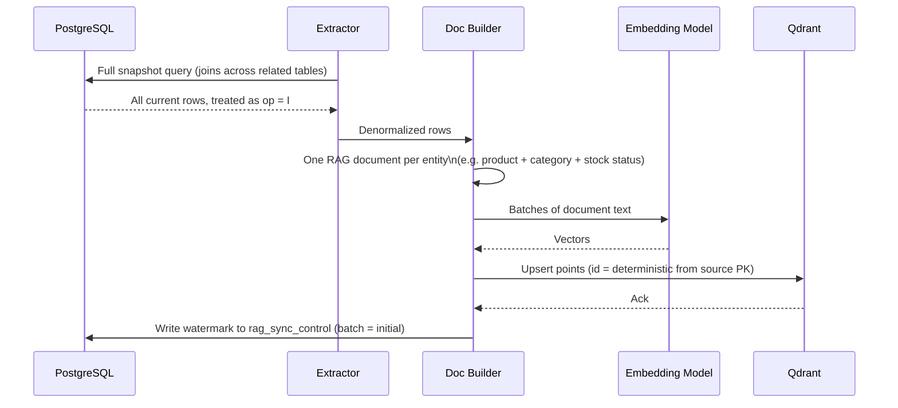
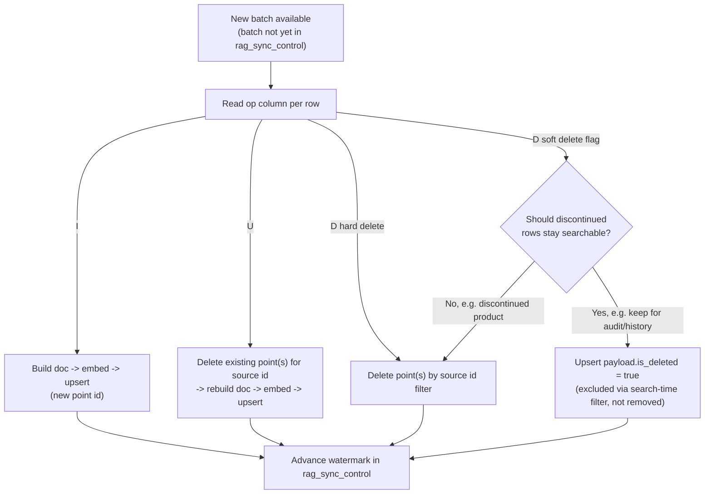
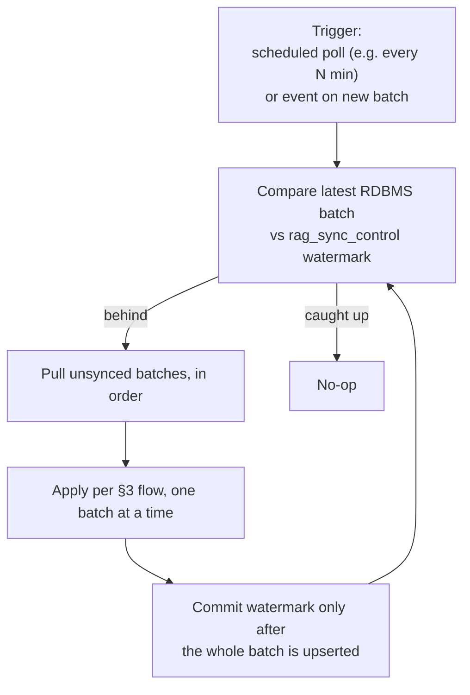

# RAG over RDBMS Data — Process Flow Design

Design only — no code. Goal: keep a Qdrant vector index in sync with data
living in PostgreSQL, covering both the **initial load** (full backfill)
and **ongoing deltas** (inserts/updates/deletes) as they land in the
RDBMS, using sound, production-grade load practices.

This reuses the change-tracking shape already in place for the RDBMS
pipeline (`ai-development-source-data/rdbms-content`): every row carries
an `op` of `I` / `U` / `D`, and a control table records which batches
have been applied. The RAG pipeline below is the downstream half of that
same pattern — it consumes the same kind of batches and keeps its own
watermark of what it has embedded so far.

VectorDB target: **Qdrant** (`QDRANT_HTTP_PORT=6333`, `QDRANT_GRPC_PORT=6334`,
per `venkatab-ai-setup/.env`).

## 1. High-Level Architecture



Two watermarks, deliberately kept separate: `etl_batch_control` tracks what
has landed in **Postgres**; `rag_sync_control` tracks what has been
propagated into **Qdrant**. The RAG pipeline can lag behind the RDBMS
without risking RDBMS consistency, and can be replayed independently
(e.g. after an embedding-model upgrade) without re-touching Postgres.

## 2. Initial Load (Full Backfill)



Runs once per collection (or whenever a full reindex is deliberately
triggered — see §8). Everything after this is incremental.

## 3. Delta Sync (Ongoing Inserts / Updates / Deletes)



Key design choice: an **update always deletes-then-rebuilds** the point(s)
for that source row rather than patching a vector in place. If the row's
text grew or shrank, the number of chunks can change; deleting the old
set first avoids orphaned stale chunks lingering in the index.

## 4. What Becomes a "Document"

RDBMS rows are short and structured — chunking in the classic long-text
sense rarely applies to a single row. The real design decision is the
**unit of embedding**:

| Source rows | RAG document | Why this grain |
|---|---|---|
| `products` + `categories` + `inventory` | One document per product: name, category, price, description, stock status | Matches how a shopping/catalog assistant is queried — "find me X" |
| `orders` + `order_items` + `payments` (+ `customers`) | One document per order: items, totals, status, payment state | Matches support-style queries — "what happened to order #X" |
| Long free-text fields only (e.g. an extended product description or a review body) | Chunked with overlap if it exceeds the embedding model's effective window | Everything else is short enough to embed whole |

Denormalize at build time — join in the foreign-key context (category
name, not just `category_id`) so the embedded text is self-contained and
the retrieved chunk makes sense without a follow-up lookup.

## 5. Qdrant Collection Design

- **Point ID**: deterministic, derived from `(source_table, source_pk[, chunk_index])` — never a random UUID. Determinism is what makes upsert-on-update and delete-on-delete safe to replay.
- **Payload (metadata) fields**: keep everything used for filtering or citation out of the embedded text and in the payload instead — `source_table`, `source_pk`, `category_id`, `price`, `status`, `updated_at`, `is_deleted`. This enables hybrid queries (vector similarity + structured filter, e.g. "similar products under $50, in stock").
- **PII handling**: never embed raw customer PII (email, phone, address) into vector text. If a customer-support RAG needs it, keep it in the payload behind an access-controlled field, not in the embedded content itself.
- **Collection per document type**: separate collections for `product_catalog` vs `order_support` rather than one mixed collection — different schemas, different access patterns, different reindex cadences.
- **Blue-green collections for reindexing**: when the embedding model changes, build into a new collection (`product_catalog_v2`), validate, then swap a Qdrant alias — never embed-in-place over a live collection.

## 6. Sync Orchestration & Watermarking



- Batches are applied **in order, one at a time, watermark advanced only
  on success** — mirrors the transactional-per-batch guarantee already
  used for the RDBMS loader, so a failed batch can be retried without
  double-applying earlier ones.
- Start with polling on an interval (simplest, matches the current
  file-batch model). Event-driven (e.g. logical replication / Debezium
  reacting to Postgres WAL) is a natural upgrade later if near-real-time
  freshness becomes a requirement — call this out as a deliberate
  non-goal for v1 rather than under-designing it silently.

## 7. Failure Handling & Recovery

- **Partial batch failure**: nothing commits to `rag_sync_control` until every row in the batch is upserted/deleted successfully — a crash mid-batch is safe to retry from the start of that same batch.
- **Embedding service outage**: retry with backoff; if a batch can't complete within a bounded number of retries, park it (log + alert) rather than skipping the watermark forward, so no data silently goes missing from the index.
- **Qdrant unavailable**: same treatment — the watermark only advances on confirmed upsert/delete acknowledgement.
- **Drift detection**: periodically reconcile — count of non-deleted source rows vs count of distinct `source_pk` values in the collection payload. A mismatch signals a missed batch or a bug, not just staleness.

## 8. Best Practices Checklist

- Deterministic point IDs from source PKs — makes every operation idempotent and safe to replay.
- Delete-then-rebuild on update, not in-place vector patch.
- Denormalize foreign-key context into the embedded text; keep filterable fields in payload, not prose.
- Never embed raw PII; keep it in access-controlled payload fields if needed at all.
- Separate collection per document type/use case.
- Blue-green collections (alias swap) for any embedding-model or chunking-strategy change — never reindex in place.
- Track the RAG sync watermark separately from the RDBMS load watermark.
- Advance the watermark only after a full batch is confirmed applied — never partially.
- Reconcile row counts vs point counts on a schedule to catch silent drift.
- Treat "soft delete in RDBMS" and "remove from search index" as two separate decisions, made explicitly per entity type (see §3), not defaulted.

## 9. Open Questions (to resolve before implementation)

- Which entity is the first RAG target — product catalog or order support — since it drives the document grain (§4) and the collection split (§5)?
- Required freshness: is polling every few minutes acceptable, or does this need near-real-time (which pulls in logical replication/Debezium)?
- Embedding model choice, and whether it can change over time (drives how seriously to take the blue-green collection design up front).

## 10. Implementation — How to Run

A working, fully local implementation of the `product_catalog` slice of this
design (§4 first row: products + categories + inventory). Everything runs
against `localhost` — Postgres, Qdrant, and Ollama — no external API keys.

```
crew-ai/
  common/
    config.py          connection settings (reads venkatab-ai-setup/.env)
    postgres_docs.py    builds one RAG document per product
    ollama_client.py    embed(), chat(), count_tokens() against local Ollama
    tokens.py            cheap offline token estimate (build-time summary only)
  scripts/
    01_build_rag.py      Step 1 - RAG creation
    02_query_rag.py       Step 2 - query RAG + exact token size
    03_chat_with_rag.py   Step 3 - CrewAI agent chat via local Ollama
```

### 0. Prerequisites (one-time)

1. **Postgres + Qdrant running and loaded.** These come from
   `venkatab-ai-setup/venkatab-ai-onboarding.yml`:
   ```
   cd D:\GIT-CODE\git_venkata\venkatab-ai-setup
   docker compose -f venkatab-ai-onboarding.yml up -d postgres vectordb
   ```
   Postgres needs the retail schema loaded (skip if already done — check
   `SELECT count(*) FROM products;`); see
   `ai-development-source-data/rdbms-content/README.md` for the full
   generator/loader flow — short version:
   ```
   cd D:\GIT-CODE\git_venkata\ai-development-source-data\rdbms-content
   docker exec -i venkatab-ai-postgres psql -U ai_admin -d ai_setup < sql\01_schema.sql
   docker exec -i venkatab-ai-postgres psql -U ai_admin -d ai_setup < sql\02_control_table.sql
   python generator\generate_data.py
   python loader\load_data.py
   ```

2. **Ollama running locally** with a chat model and an embedding model pulled:
   ```
   ollama pull llama3.2
   ollama pull nomic-embed-text
   ```
   (`ollama serve` must be reachable at `http://localhost:11434` — the
   desktop app / installed service does this automatically.)

3. **Python deps**, isolated in a project-local venv so CrewAI's dependency
   tree doesn't spill into the system Python:
   ```
   cd D:\GIT-CODE\git_venkata\crew-ai
   python -m venv .venv
   .venv\Scripts\pip install -r requirements.txt
   ```
   All commands below assume this venv's Python: `.venv\Scripts\python.exe`.

### 1. RAG creation

Builds one document per product (denormalized with category + stock),
embeds each with `nomic-embed-text` via Ollama, and upserts into the Qdrant
collection `product_catalog` using deterministic point IDs (§5).

```
cd D:\GIT-CODE\git_venkata\crew-ai
.venv\Scripts\python.exe scripts\01_build_rag.py --recreate
```

Drop `--recreate` on later runs to upsert into the existing collection
(idempotent — same product re-embeds to the same point ID). Expect ~2–3s per
product on first run (Ollama has to load the embedding model into memory);
it prints a running count and a final summary (points upserted, approx.
tokens embedded, elapsed time).

### 2. Calling the RAG and calculating the called token size

Embeds a query, searches `product_catalog` in Qdrant, and reports **exact**
token counts (read from Ollama's own tokenizer via `prompt_eval_count`, not
an approximation) for the query, each retrieved chunk, and the assembled
context block — i.e. what step 3 would actually send to the model.

```
.venv\Scripts\python.exe scripts\02_query_rag.py --query "What laptops do you have in stock?" --top-k 3
```

`--top-k` controls how many chunks are retrieved (default 5); the token
report scales with it, which is the point — this is how you'd size context
before wiring a bigger top-k or a bigger prompt template into production.

### 3. Chatting with the RAG using local Ollama (via CrewAI)

A CrewAI `Agent` (LLM = `ollama/llama3.2`, no API key — `crewai.LLM` points
straight at `http://localhost:11434`) with one tool, `product_catalog_search`,
that does the same embed-and-search as step 2. The agent must call the tool
before answering.

```
.venv\Scripts\python.exe scripts\03_chat_with_rag.py --question "Do you have any kitchen appliances under 50000, and are they in stock?"
```

Prints the agent's reasoning trace, the final answer, and a token-usage
summary (`prompt_tokens` / `completion_tokens` / `total_tokens`) collected
by CrewAI across the run.

### Notes

- Telemetry: CrewAI's anonymous telemetry/tracing tries to phone home over
  HTTPS; `common/config.py` sets `CREWAI_DISABLE_TELEMETRY=true` and
  `OTEL_SDK_DISABLED=true` before CrewAI is imported, so this stays fully
  offline. If you add new entry points, import `common.config` before
  importing `crewai`.
- Windows console: `03_chat_with_rag.py` reconfigures stdout/stderr to
  UTF-8, since CrewAI's console logging includes emoji that the default
  Windows codepage can't encode.
- Scope: this covers the §2 initial-load path for one document type
  (product catalog) end to end. The §3 delta-sync flow (insert/update/delete
  handling, watermarking) and the order-support document type are designed
  but not yet implemented — see §9.
